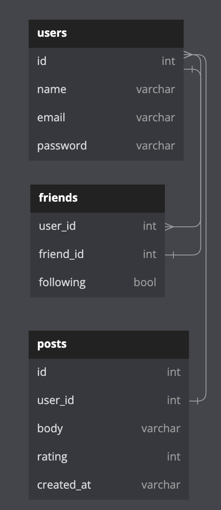

Our project is organized using various services to facilitate database utility.
The services are as follows:

- userService
- postsService
- friendsService

## userService

The userService is responsible for handling all user related operations, such as `get_user`, `get_user_by_email`, `get_user_by_name` and `add_user`.

## postsService

The postsService is responsible for handling all post related operations, such as `upvote_post`, `add_post`, `get_posts_for_user`.

## friendsService

The friendsService is responsible for handling all friend related operations, such as `get_friends`, `add_friend`, and `remove_friend`, `INTERNAL_get_friends_of_friends`.

# How To Use

Run `make run` to start interacting with the database. Run `make clean` to restart changes made and start fresh.

Interact with the program using the terminal. The program will prompt you for input.

### Basic Commands:

`1` will create a random user_id

`2` create a post for that user

`3` add a friend a user

### Interesting Queries:

For more information check out the _management_ section of `main.py`
``

# Database

The database is organized using the following tables:

```sql
CREATE TABLE IF NOT EXISTS users(
id INTEGER PRIMARY KEY AUTOINCREMENT,
name TEXT,
email TEXT UNIQUE,
password TEXT);

CREATE TABLE IF NOT EXISTS posts(
id INTEGER PRIMARY KEY AUTOINCREMENT,
user_id INTEGER,
body TEXT,
rating INTEGER DEFAULT 0,
created_at DATETIME NOT NULL DEFAULT CURRENT_TIMESTAMP,
FOREIGN KEY(user_id) REFERENCES users(id)
)

CREATE TABLE IF NOT EXISTS friends(
user_id INTEGER,
friend_id INTEGER,
following BOOL,
FOREIGN KEY(user_id) REFERENCES users(id),
FOREIGN KEY(friend_id) REFERENCES users(id)
)
```


